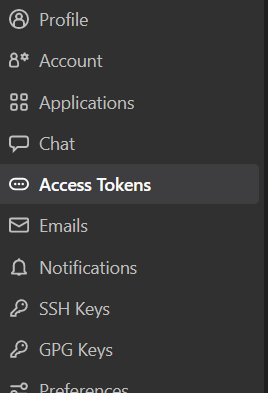
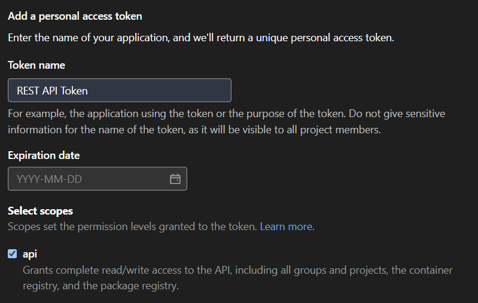

# GitLab-Tools

Ein Projekt mit Beispiel-Skripten für die automatisierte Verwendung von GitLab mithilfe der [REST API](https://docs.gitlab.com/ee/api/).

## Initiales Setup

### Access Token für Zugriffe einrichten

Bevor die Skripte laufen können, muss im Git ein Access Token für Deinen Account eingerichtet werden.




### Testprojekt einrichten

Weiterhin erstellst Du Dir ein eigenes Testprojekt, in dem Du Schreibberechtigung hast.

### IntelliJ konfigurieren

Im IntelliJ erstellst Du Dir eine private Umgebungskonfiguration für den HTTP Client und trägst dort die Daten ein:

```json
{
  "dev": {
    "token": "{{access-token}}",
    "sample-project-id": "{{project-id}}"
  }
}
```

Das Access-Token trägst Du außerdem in die [Konfigurationsdatei der Anwendung](src/config/gitlab.json) ein.
Beide Dateien sind von der Versionierung ausgeschlossen.
